# Balanceador con MySQL y Nginx

En este proyecto realizaremos una configuración con una máquina que funcionará como balanceador, 2 que funcionarán con Nginx y PHP y una ultima que tendra MySQL Server.

## Configuración VagrantFile y scripts de aprovisionamiento.

Empezaremos creando las maquinas con sus IP respectivas en el archivo **VagrantFile** que se genera al hacer un _vagrant init_ en la línea de comandos de nuestra terminal. La máquina que actuará de balanceador tendra una sola dirección privada con una red interna. Las máquina de MySQL tendrá también una sola dirección privada en otra red interna diferente a la del balanceador. Por último, las máquinas con Nginx tendrán dos direcciones privadas que esten en la misma red interna que las anteriores, una dirreción en cada red interna.

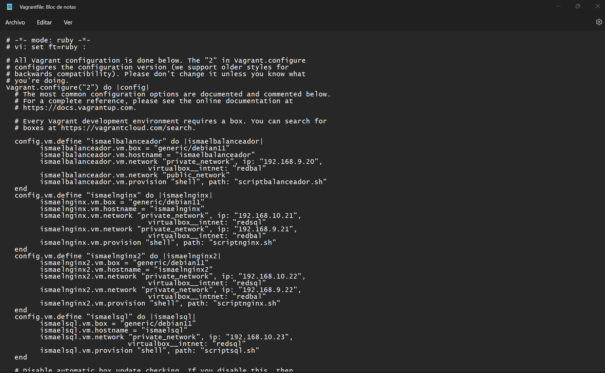

También hay que configurar los scripts que aprovisionarán las máquinas para que de esta forma, la primera vez que las iniciemos se instalen los paquetes necesarios de cada una.

### Script máquina MySQL

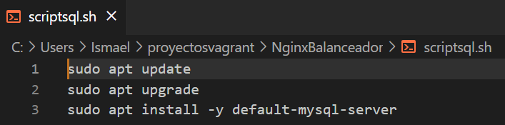

### Script máquinas Nginx

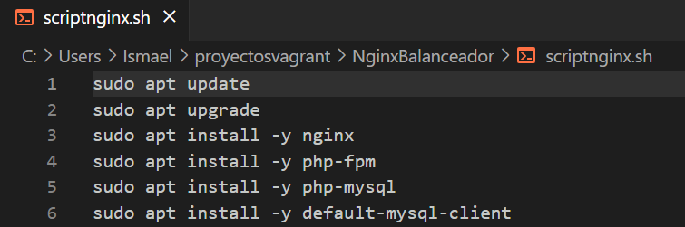

### Script máquina Balanceador

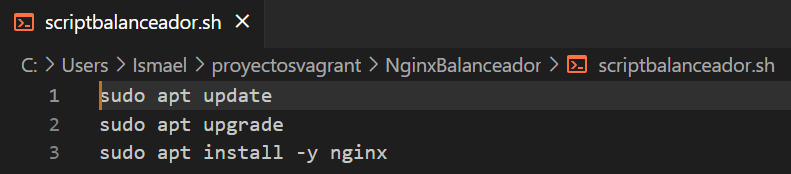

## Configuración máquina MySQL.

Empezaremos configurando esta máquina. Para ello, lo primero que haremos será acceder al directorio /etc/mysql/mariadb.conf.d_ y una vez dentro, modificaremos el fichero _50-server.cnf_ con el siguiente comando.

    sudo nano 50-server.conf

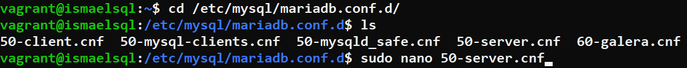

Una vez dentro del fichero, habrá que cambiar la línea _bind-address_ y aquí pondremos la IP de nuestra máquina MySQL.

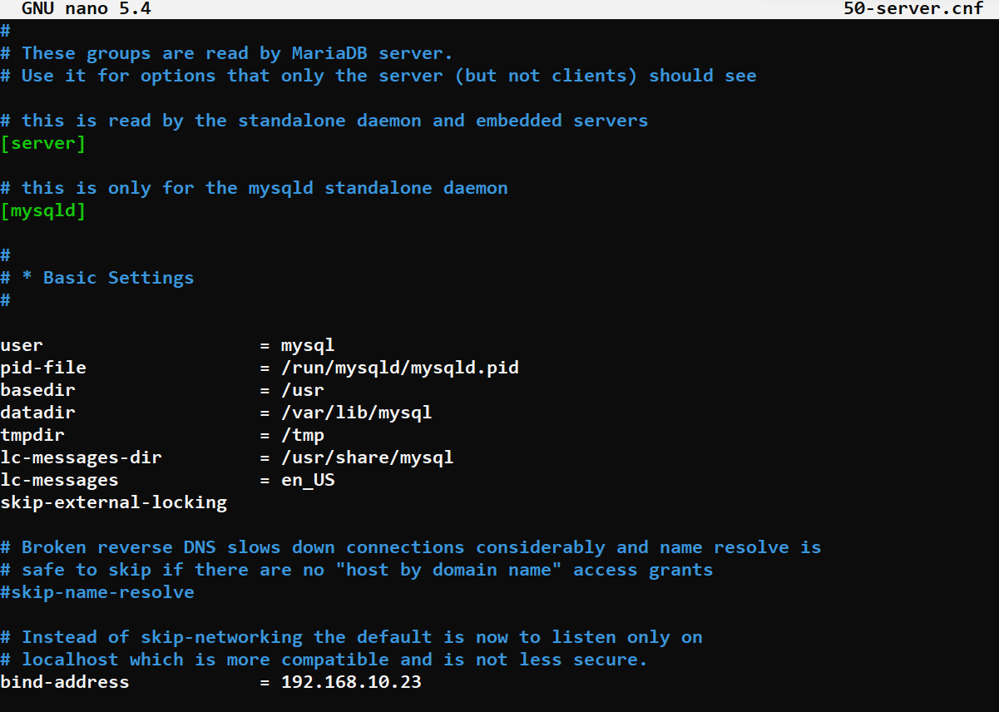

Después de esto, tendremos que asignar una contraseña al root de MySQL para poder acceder con el posteriormente. Esto lo haremos con el comando **sudo mysql_secure_installation**, este comando nos mostrará una sucesión de preguntas para la configuración a las que responderemos que sí. Al principio pedirá contraseña pero al no tener ninguna, pulsaremos enter y podremos continuar. Justo seguido de la primera pregunta, nos dará la opción para cambiar la contraseña.

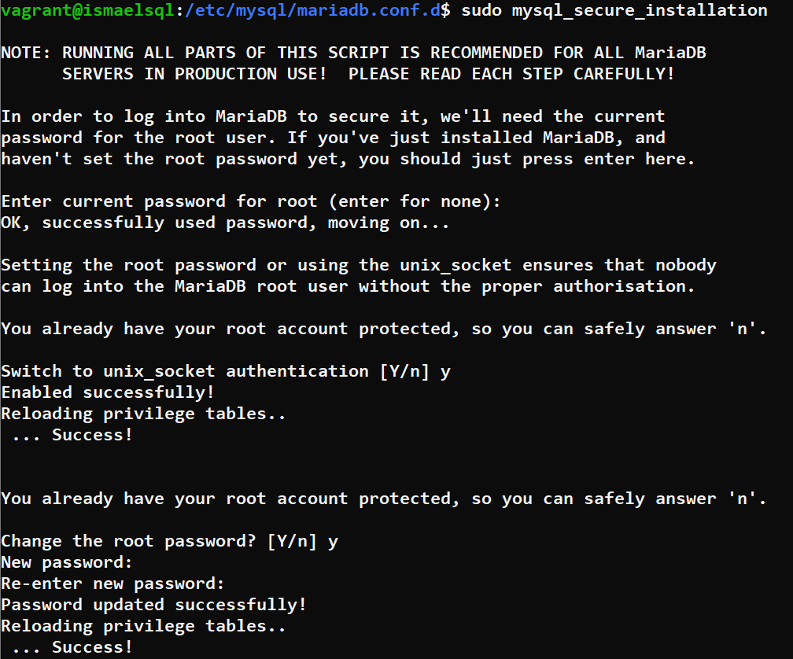

Ahora entraremos a MySQL como usuario root y crearemos un usuario normal con la IP de la máquina Nginx (al haber más de una máquina, pondremos un % para que haga referencia a todas). A este usuario le daremos todos los permisos dentro de la base de datos que posteriormente agregaremos.

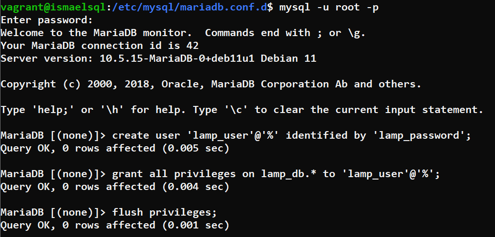

En el home de esta maquina clonaremos el repositorio de git que usaremos para descargar nuestra base de datos.

    cd $HOME
    sudo git clone https://github.com/josejuansanchez/iaw-practica-lamp.git

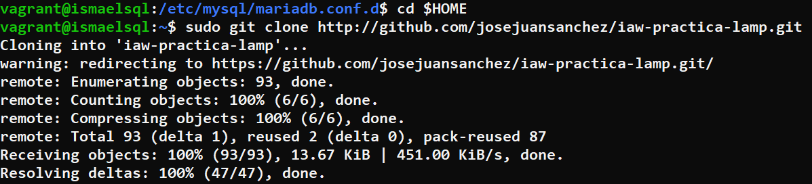

Ahora para importar la base de datos a nuestro MySQL, primero tendremos que entrar a la carpeta que se nos ha creado con el paso anterior y después entrar al directorio _db_. Una vez aquí, editaremos el fichero _database.sql_ y borraremos las 3 últimas líneas.

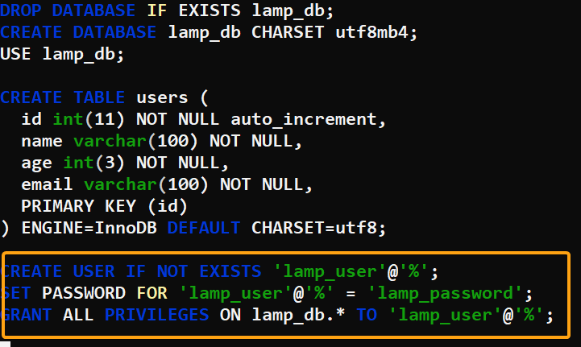

Una vez hecho esto, importaremos la base de datos a nuestro MySQL usando el fichero _database.sql_. Para ello usaremos el siguiente comando:

    mysql -u root -p < database.sql

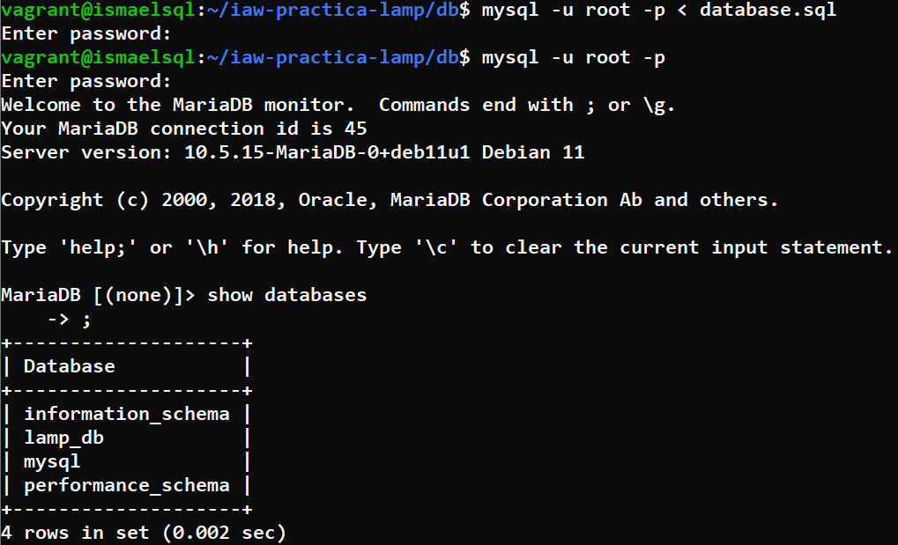

Con esto habríamos terminado la configuración de esta máquina por lo que podremos borrar la carpeta _iaw-practica-lamp_.

## Configuración máquinas Nginx.

Este proceso lo realizaremos en ambas máquinas ya que tendrán la misma configuración.Para empezar, tendremos que ir a _/var/www_, crear una carpeta con el nombre que queramos y cambiarle el dueño y grupo. Una vez hecho entramos a ella y clonamos el repositorio de git **https://github.com/josejuansanchez/iaw-practica-lamp.git**.

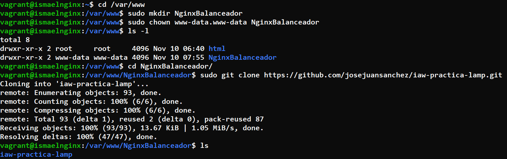

Al clonar el repositorio se nos crea una carpeta, entraremos a ella y moveremos a la carpeta _NginxBalanceador_ todo el contenido de la carpeta _src_. 

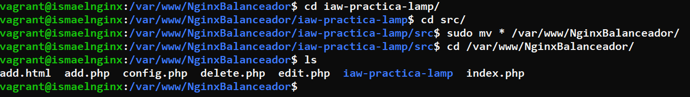

Lo siguiente, sería definir la IP de MySQL. Esto lo haremos en el fichero _config.php_ cambiando el valor de **DB_HOST**.

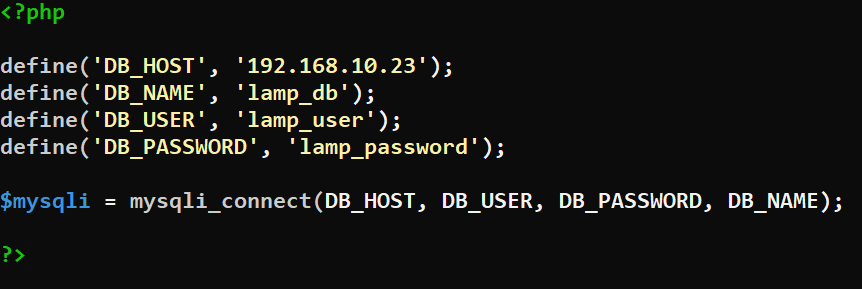

Ahora vamos a la ruta _/etc/php/7.4/fpm/pool.d_ y configuramos el fichero _www.conf_ para poder conectarnos por **socket TCP/IP**.

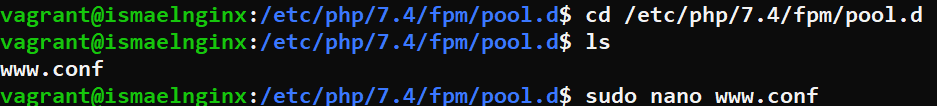

Aquí bajaremos hasta la línea que empieza por la palabra listen y borraremos lo que esta escrito para poner la IP 127.0.0.1 con el puerto 9000.

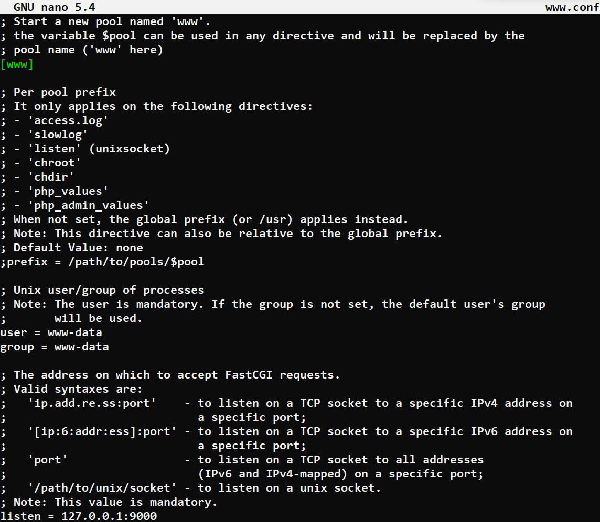

Ahora reiniciamos el servicio con **sudo systemctl restart php7.4-fpm**. En la ruta _/etc/nginx/sites-available_, duplicaremos el fichero _default_ y en el nuevo pondremos en root la ruta de la carpeta _NginxBalanceador_ y añadiremos **index.php** al lado de **index.html** para que pueda detectar el servicio PHP. Más abajo, desdocumentaremos las líneas de los location dejando la de **fastcgi_pass unix** documentada ya que esta solo se usa cuando quieres emplear una conexión mediante un socket unix.

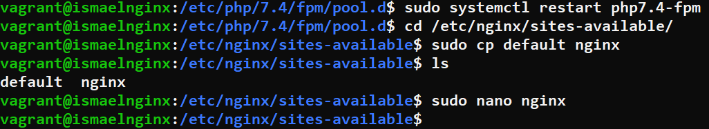

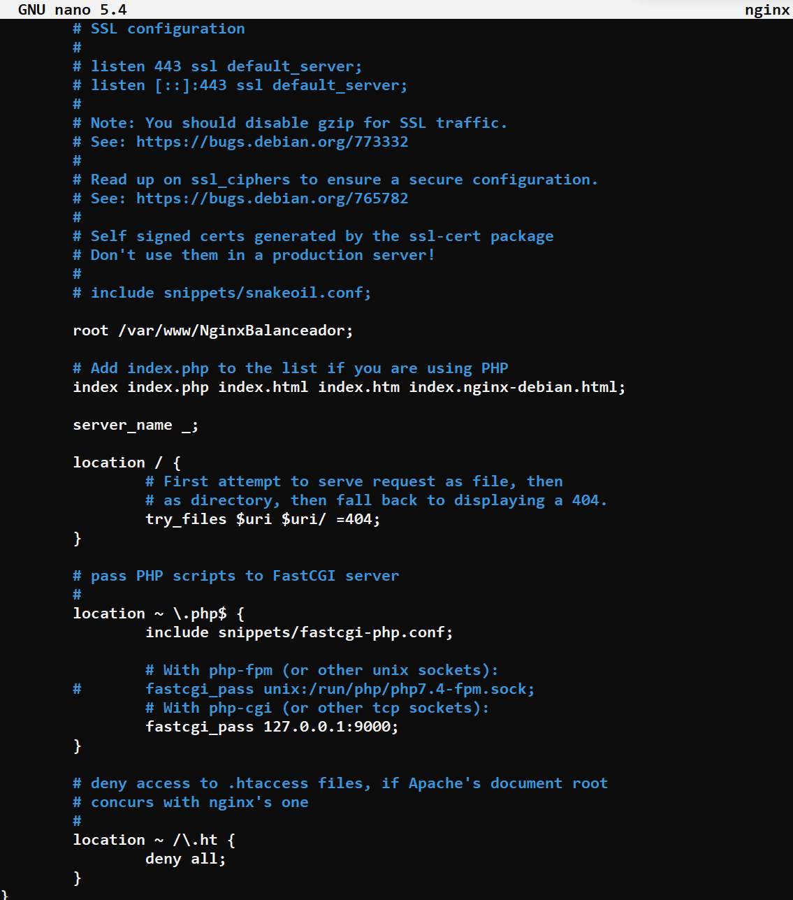

Una vez configurado, haremos un enlace de este archivo hacia _sites-enabled_ y borraremos el que había de default.

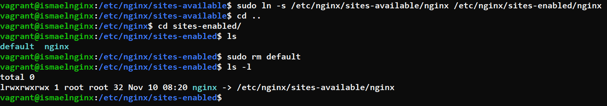

Ahora con **sudo nginx -t** comprobamos que la configuración del servicio nginx se haya realizado correctamente y para finalizar reiniciamos el servicio.

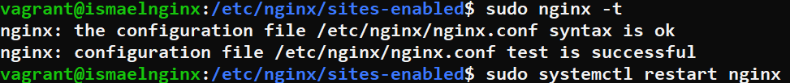

## Configuración máquina Balanceador.

Primero vamos a _/etc/nginx/sites-enabled_ y borramos el archivo default.

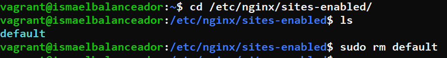

Ahora crearemos un fichero en _/etc/nginx/conf.d_ y le agregaremos las siguientes líneas.

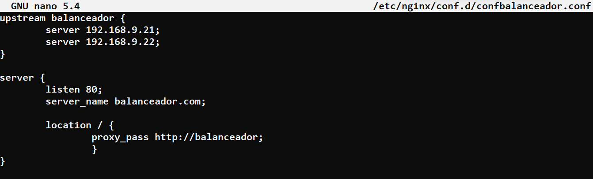

Con esto ya quedaría configurado nuestro balanceador.
